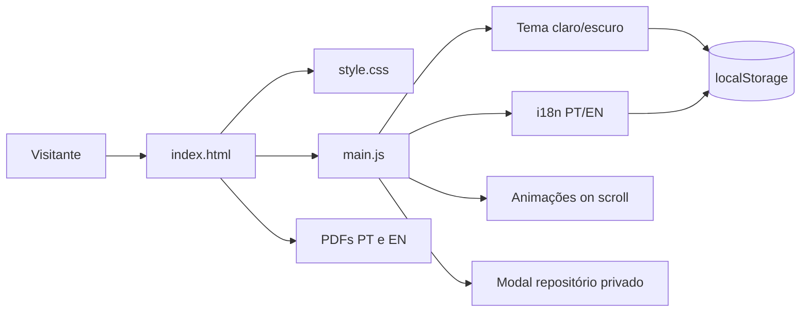

<div align="center">
  <h1>📄 Currículo Web</h1>
  <h3>Currículo profissional interativo de Richard Oliveira</h3>
  <p>
    Uma página única, bilíngue e responsiva que reúne trajetória, experiências,<br />
    projetos em destaque, habilidades e formação — sem build, sem dependências.
  </p>
  <p>
    <a href="https://curriculo-richard-oliveira.vercel.app/"></a>
    <a href="https://developer.mozilla.org/pt-BR/docs/Web/HTML"></a>
    <a href="https://developer.mozilla.org/pt-BR/docs/Web/CSS"></a>
    <a href="https://developer.mozilla.org/pt-BR/docs/Web/JavaScript"></a>
    
    <a href="LICENSE"></a>
  </p>
  <p>
    <a href="#-sobre-o-projeto">Sobre</a> •
    <a href="#-funcionalidades">Funcionalidades</a> •
    <a href="#-tecnologias">Tecnologias</a> •
    <a href="#-execução-local">Execução</a> •
    <a href="#-internacionalização">i18n</a> •
    <a href="#-créditos">Créditos</a>
  </p>
</div>

---

## 📌 Sobre o projeto

O **Currículo Web** é a versão navegável do meu currículo: em vez de um PDF estático, uma
página que pode ser lida em português ou inglês, no tema claro ou escuro, em qualquer tela.

O projeto foi escrito propositalmente em **HTML, CSS e JavaScript puros**. Não há bundler,
framework ou etapa de build — o navegador abre o `index.html` e a página funciona. A intenção é
que o próprio código sirva de amostra: semântica correta, CSS organizado por variáveis e um
JavaScript pequeno e legível.

Os PDFs em PT e EN continuam disponíveis para download direto na seção **Recursos**, para quem
precisa anexar o currículo em um processo seletivo.

> **Status:** publicado e em manutenção contínua. Conteúdo sincronizado com o
> [portfólio principal](https://richardesley-dev.vercel.app/).

## ✨ Funcionalidades

| Área                     | Recursos disponíveis                                                                                     |
| ------------------------ | -------------------------------------------------------------------------------------------------------- |
| 🌎 **Bilíngue**          | Alternância PT/EN em tempo real, sem recarregar a página, com preferência persistida                     |
| 🌗 **Tema claro/escuro** | Respeita `prefers-color-scheme` no primeiro acesso e memoriza a escolha manual depois                    |
| 🧭 **Navegação**         | Navbar fixa com sombra ao rolar, âncoras suaves entre seções e botão de voltar ao topo                   |
| 💼 **Experiências**      | Linha do tempo com cargo, empresa, período, descrição e link para o projeto quando aplicável             |
| 🚀 **Projetos**          | Cards em destaque com papel exercido, status, stack detalhada e links para demo e código                 |
| ⚡ **Habilidades**       | Chips agrupados por área; ao passar o mouse, um balão mostra onde cada habilidade foi aplicada           |
| 🎓 **Educação**          | Formação acadêmica e técnica com períodos e previsão de conclusão                                        |
| 📄 **Recursos**          | Download dos currículos em PDF (PT e EN), portfólio, certificados e GitHub                               |
| ♿ **Acessibilidade**     | HTML semântico, `aria-*` nos controles, foco visível e suporte a `prefers-reduced-motion`                |

### Projetos em destaque

A ordem da seção reflete a relevância de cada trabalho:

| # | Projeto | Papel | Stack principal |
| - | ------- | ----- | --------------- |
| 01 | **GMC — Granja Mult Core** | Líder de equipe (5 integrantes) | React 18 · TypeScript · Vite · Material UI · Supabase · PostgreSQL |
| 02 | **Abdoria — Core Quest** | Projeto autoral, full stack | React 19 · TypeScript · Tailwind · Framer Motion · Express 5 · Supabase |
| 03 | **InstaAnalytics** | Líder de equipe (3 integrantes) | React · TypeScript · Tailwind · Supabase · Python |

Abaixo dos destaques, uma grade menor lista Purple Kaizen, SASens e App WhatsApp.

## 🧭 Estrutura da página

1. **Hero** — nome, atuação, contatos diretos (e-mail, telefone, portfólio, LinkedIn, GitHub).
2. **Sobre** — resumo profissional e três indicadores de trajetória.
3. **Experiências** — linha do tempo cronológica, da atual à mais antiga.
4. **Projetos em destaque** — três cards detalhados e uma grade de projetos complementares.
5. **Habilidades** — chips agrupados por área técnica.
6. **Educação** — graduação, curso técnico e formação em inglês.
7. **Recursos** — portfólio, PDFs e GitHub.

## 🛠 Tecnologias

- **HTML5** semântico, com `header`, `nav`, `section`, `article` e `footer`.
- **CSS3** com custom properties, CSS Grid, Flexbox e temas por classe no `body`.
- **JavaScript (ES6+)** sem dependências: dicionário de traduções, `IntersectionObserver`
  para as animações de entrada e `localStorage` para tema e idioma.
- **Google Fonts** — `Outfit` para texto e `JetBrains Mono` para datas, números e stacks.
- **Vercel** para deploy contínuo a partir da branch `main`.

## 🏗️ Arquitetura



Princípios adotados:

- uma única página, sem roteamento nem estado global;
- todas as cores derivam de custom properties em `:root` e `.dark-theme`;
- todo texto traduzível é marcado com `data-i18n` no HTML, nunca escrito duas vezes no JS;
- nenhuma requisição a API externa — a página funciona offline depois do primeiro acesso;
- nenhum dado do visitante é coletado, enviado ou armazenado além das duas preferências locais.

## ⚙️ Pré-requisitos

- Um navegador moderno (Chrome, Edge, Firefox ou Safari).
- Git, para clonar o repositório.
- Opcionalmente, Node.js — apenas para subir um servidor local.

Não há `package.json`, `node_modules` nem etapa de build.

## 🚀 Execução local

### 1. Clone o repositório

```bash
git clone https://github.com/RDEsley/Curriculo_Web.git
cd Curriculo_Web
```

### 2. Abra a página

A forma mais simples é abrir o `index.html` diretamente no navegador.

Para reproduzir o ambiente de produção — caminhos absolutos e carregamento de PDFs — prefira um
servidor local:

```bash
# Com Node.js
npx serve .

# Ou com Python
python -m http.server 5500
```

Acesse [http://localhost:3000](http://localhost:3000) ou [http://localhost:5500](http://localhost:5500),
conforme a ferramenta escolhida.

## 📁 Estrutura do projeto

```text
.
├── index.html                 # Página completa e marcações data-i18n
├── LICENSE                    # Licença MIT
└── src/
    ├── images/                # Favicons
    ├── pdfs/                  # Currículos em PDF (PT e EN)
    ├── scripts/
    │   ├── main.js            # Tema, i18n, navbar, animações, topo e modal
    │   └── script.js          # Legado da versão anterior (ver Limites atuais)
    └── styles/
        ├── style.css          # Estilos da página, temas e responsividade
        └── certificados.css   # Legado da versão anterior (ver Limites atuais)
```

## 🌎 Internacionalização

O idioma é trocado sem recarregar a página. O HTML marca o que deve ser traduzido e o
JavaScript aplica o dicionário correspondente:

```html
<!-- Texto puro -->
<h3 data-i18n="exp2.title">Assistente Administrativo</h3>

<!-- Texto com marcação HTML (negrito, links) -->
<p data-i18n-html="about.text">Desenvolvedor <strong>Full Stack</strong>…</p>
```

```js
// src/scripts/main.js
const translations = {
  pt: { 'exp2.title': 'Assistente Administrativo' },
  en: { 'exp2.title': 'Administrative Assistant' }
};
```

Para adicionar um texto novo:

1. escreva o conteúdo em português no `index.html` e marque com `data-i18n="chave.nova"`;
2. adicione `'chave.nova'` nos **dois** blocos (`pt` e `en`) de `translations`;
3. recarregue a página e alterne o idioma para conferir.

O conteúdo em português permanece no HTML como valor padrão, então a página continua legível
mesmo que o JavaScript não carregue.

Os balões de origem das habilidades ficam num mapa separado, `skillTips`, indexado pelo
`data-skill` do chip. Para adicionar uma habilidade nova, inclua o chip no `index.html` com
`class="skill" data-skill="chave" tabindex="0"` e a frase correspondente nos blocos `pt` e `en`
de `skillTips`. Os balões são um complemento visual: aparecem apenas em dispositivos com
ponteiro real (`@media (hover: hover)`) e por foco de teclado.

### Preferências persistidas

| Chave de `localStorage` | Valores            | Efeito                                    |
| ----------------------- | ------------------ | ----------------------------------------- |
| `lang`                  | `pt` \| `en`       | Idioma aplicado ao abrir a página          |
| `tema`                  | `claro` \| `escuro`| Tema aplicado ao abrir a página            |

Sem valor salvo, o idioma padrão é `pt` e o tema segue a preferência do sistema operacional.

## ♿ Acessibilidade e performance

- Hierarquia de títulos consistente e landmarks nativos para leitores de tela.
- Controles de idioma e tema com `aria-pressed`, `aria-label` e `role="group"`.
- Modal de repositório privado com `role="alert"`, fechamento por `Esc` ou clique fora e
  devolução do foco ao botão de origem.
- Contraste conferido nos dois temas, incluindo os selos de status dos projetos.
- `prefers-reduced-motion` desativa animações e transformações de hover.
- Sem imagens pesadas, sem JavaScript de terceiros e sem rastreadores.

## 🚢 Deploy

O deploy é feito na **Vercel**, a partir da branch `main`, sem configuração adicional: o projeto
é servido como site estático a partir da raiz do repositório.

- Produção: <https://curriculo-richard-oliveira.vercel.app/>

## ⚠️ Limites atuais

- Os arquivos `src/scripts/script.js` e `src/styles/certificados.css` são resquícios da versão
  anterior, quando a listagem de certificados vivia neste repositório. Hoje os certificados
  ficam no [portfólio principal](https://github.com/RDEsley/richardesley.dev) e esses arquivos
  não são referenciados pelo `index.html`.
- Os dados dos projetos estão escritos diretamente no HTML; não há um arquivo de dados único
  como o `projetos.js` do portfólio.
- Sem testes automatizados nem verificação de links em CI.
- A tradução cobre a interface e os textos do currículo, mas os PDFs seguem em arquivos
  separados por idioma.

## 🤝 Contribuição

Este é um repositório pessoal, mas correções são bem-vindas.

1. Crie uma branch a partir de `main`.
2. Faça mudanças pequenas e focadas.
3. Confira a página nos dois idiomas e nos dois temas antes de abrir o PR.
4. Use Conventional Commits.
5. Descreva no pull request o que mudou e como testar.

Não versione arquivos `.env`, credenciais ou documentos pessoais além dos currículos já
publicados em `src/pdfs/`.

## 📄 Licença

Distribuído sob a licença MIT. Consulte [LICENSE](LICENSE) para mais informações.

O código é livre para reuso. O **conteúdo do currículo** — nome, experiências, formação e
documentos em PDF — é pessoal: se for usar o projeto como base, substitua por seus dados.

---

## 👨‍💻 Créditos

<div align="center">
  <a href="https://github.com/RDEsley">
    
  </a>
  <h3>Richard Oliveira</h3>
  <p><strong>Desenvolvedor Full Stack • UI/UX Focus</strong></p>
  <p>Fundador &amp; Desenvolvedor · Fate Eight Tech</p>
  <p>
    <a href="https://richardesley-dev.vercel.app/"></a>
    <a href="https://github.com/RDEsley"></a>
    <a href="https://www.linkedin.com/in/richardesley/"></a>
    <a href="mailto:richardesleyso@gmail.com"></a>
  </p>
  <p>Um currículo que também é um projeto. ⭐</p>
</div>
